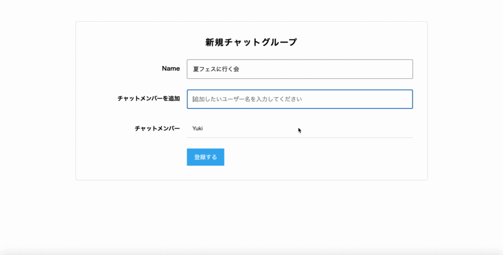
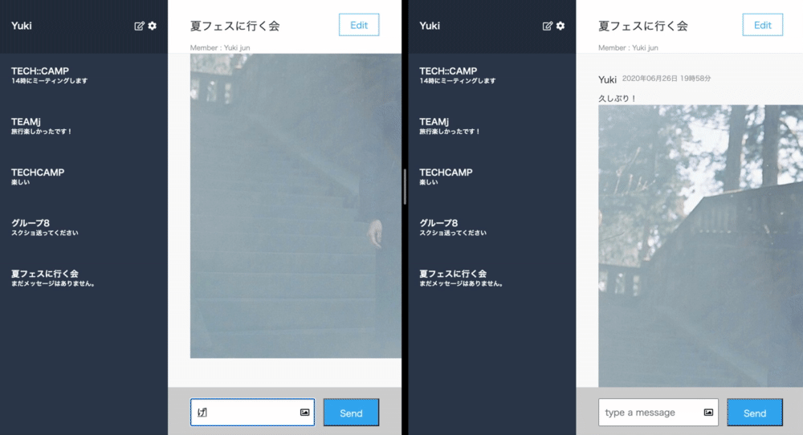

<h2 align="center">Chat Space</h2>

# 概要
**友人や仲間とグループで会話できる**チャットアプリです。ユーザーは、他のユーザーを招待し、写真またはテキストのやりとりを通じてグループチャットを楽しむことができます。

# 制作期間
20日間

# 制作背景
TECHCAMPというプログラミングスクールのカリキュラム内にある課題制作です。
新しい技術（機能）として、以下のことを実装しました。

- 新規登録機能
- 複数人によるグループチャット機能
- チャット相手の検索機能
- チャットグループへのユーザー招待機能
- チャットの履歴表示機能
- 画像送信機能
- チャットの自動更新
 
# DEMO

### 1. トップページからログイン

### 2. 他のユーザーを招待して、グループを作成

### 3.　テキストまたは写真を送信すると、相手の画面が自動で更新され、リアルタイムでチャットができる

# 工夫したポイント
- 

# 使用技術(開発環境)
Ruby/Ruby on Rails/MySQL/Github/Visual Studio Code

# 課題や今後実装したい機能
<dl>
  <dt>本番環境で画像が表示されない</dt>
  <dd>S3のストレージと連携させることで、heroku特有のデータベースリセットを回避する</dd>
  <dt>ボランティアガイドの申し込みの手続きが複雑かつ認知されていない</dt>
  <dd>施設の公式アカウントを作成し、ボランティアガイドとユーザーのマッチング機能を実装する</dd>
  <dt>検索方法を増やす</dt>
  <dd>ジャンルテーブルを作成し、ジャンルでユーザーが検索できるようにする</dd>
  <dt>ログイン方法を増やす</dt>
  <dd>APIを用いて、手軽なSNSログインを実装することで、ユーザーの利用率をあげる</dd>
  <dt>遺産の場所が一目でわからない</dt>
  <dd>GoogleMapのAPIを実装し、遺産の場所がすぐにわかるようにしたい</dd>
  <dt>多言語対応していない</dt>
  <dd>英語の翻訳版も載せられるようにしたい</dd>
</dl>

# DB設計

## usersテーブル

|Column|Type|Options|
|------|----|-------|
|email|string|null: false|
|password|string|null: false|
|nickname|string|null: false|

### Association
- has_many :messages
- has_many :groups, through: :groups_users
- has_many :groups_users

 ## groupsテーブル

|Column|Type|Options|
|------|----|-------|
|name|stringr|null: false|

### Association
- has_many :messages
- has_many :users, through: :groups_users
- has_many :groups_users
 
 ## groups_usersテーブル

|Column|Type|Options|
|------|----|-------|
|user_id|integer|null: false, foreign_key: true|
|group_id|integer|null: false, foreign_key: true|

### Association
- belongs_to :group
- belongs_to :user

## messagesテーブル

|Column|Type|Options|
|------|----|-------|
|body|text|-------|
|image|text|-------|
|user_id|integer|null: false, foreign_key: true|
|group_id|integer|null: false, foreign_key: true|

### Association
- belongs_to :group
- belongs_to :user
